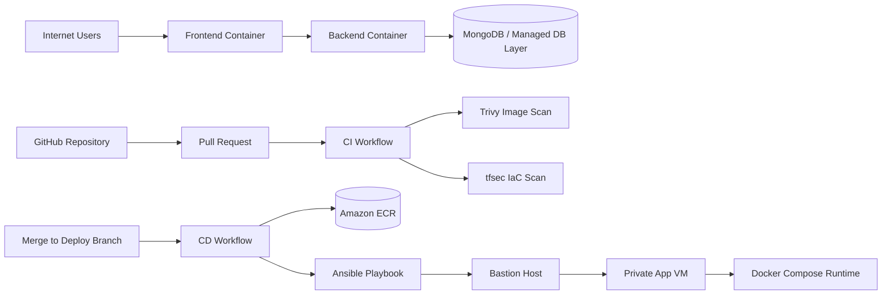

# Learn2Grow - Complete DevOps Pipeline Project

Learn2Grow is an education platform that connects students with local teachers and coaches through structured courses. This repository demonstrates a full DevOps workflow from infrastructure provisioning to automated deployment.

## Team Members

- Member 1 - Role: Terraform and Infrastructure as Code
- Member 2 - Role: Ansible and Production Deployment
- Member 3 - Role: CI/CD and Security Scanning

Replace the names and roles above before final submission.

## Live Application

- Live URL: http://YOUR_PUBLIC_URL
- API Base URL: http://YOUR_PUBLIC_URL:5000/api

Replace these URLs with your deployed endpoints.

## Project Overview

### Problem Statement

Many students in Africa depend only on classroom teaching and have limited access to structured local learning resources. Learn2Grow provides a platform where students can discover courses while teachers and coaches upload and manage educational content.

### Core Features

1. Role-based authentication (student, teacher, admin)
2. Course creation and moderation flow
3. Public approved course listing
4. Student enrollment-ready backend API design

## Architecture Overview

### Architecture Diagram (Mermaid)



### Infrastructure Components

- VPC with segmented public and private networking
- Bastion host in public subnet for controlled SSH access
- App VM in private subnet for application runtime
- Security groups to restrict network flows
- Amazon ECR repositories for frontend and backend images
- Terraform remote state in S3 with locking enabled

## Technology Stack

- Cloud Provider: AWS
- Frontend: React 18, Vite, TypeScript, Tailwind CSS
- Backend: Node.js, Express
- Database: MongoDB (application integration via MONGO_URI)
- Containerization: Docker and Docker Compose
- IaC: Terraform (modular)
- Configuration Management: Ansible
- CI/CD: GitHub Actions
- Security Scanning: Trivy and tfsec

## Repository Structure

```text
.
|- .github/workflows/
|  |- ci.yml
|  |- cd.yml
|- terraform/
|  |- main.tf
|  |- variables.tf
|  |- outputs.tf
|  |- terraform.tfvars.example
|  |- modules/
|- ansible/
|  |- inventory.ini
|  |- playbook.yml
|  |- roles/docker/tasks/main.yml
|- frontend/
|  |- src/
|  |- Dockerfile
|  |- package.json
|- backend/
|  |- src/
|  |- Dockerfile
|  |- package.json
|- docker-compose.yml
|- API_DOCS.md
|- README.md
```

## Setup Instructions

### Prerequisites

1. AWS account and IAM permissions for EC2, VPC, ECR, and S3
2. Terraform >= 1.5
3. Ansible
4. Docker and Docker Compose
5. Node.js 22+
6. GitHub repository secrets configured

### 1) Clone Repository

```bash
git clone https://github.com/YOUR-ORG/YOUR-REPO.git
cd Learn2grow
```

### 2) Configure Terraform Variables

```bash
cd terraform
cp terraform.tfvars.example terraform.tfvars
```

Update terraform.tfvars values for your environment:

- aws_region
- key_pair_name
- db_password

### 3) Provision Infrastructure

```bash
terraform init
terraform fmt -recursive
terraform validate
terraform apply
```

After apply, capture outputs such as:

- bastion_public_ip
- app_private_ip
- ecr_frontend_url
- ecr_backend_url

### 4) Prepare GitHub Secrets

Configure the following repository secrets:

- AWS_ACCESS_KEY_ID
- AWS_SECRET_ACCESS_KEY
- AWS_REGION
- ECR_REGISTRY
- SSH_PRIVATE_KEY

### 5) Deploy with Ansible

Update ansible/inventory.ini with current bastion and private app host values.

Run:

```bash
cd ansible
ansible-playbook -i inventory.ini playbook.yml
```

### 6) Local Development (Optional)

Run the stack with Docker Compose:

```bash
docker-compose up --build
```

Default local endpoints:

- Frontend: http://localhost:3000
- Backend API: http://localhost:5000

Stop services:

```bash
docker-compose down
```

## CI/CD Pipeline

### CI Pipeline

- Workflow file: .github/workflows/ci.yml
- Triggers:

1. Pull requests to main
2. Pushes to frontend branch

- Jobs:

1. Backend lint, test, Docker build, Trivy scan
2. Frontend lint, test, Docker build, Trivy scan
3. Terraform scan with tfsec

Security gates in CI:

- Trivy image scanning with non-zero exit code on configured severity threshold
- tfsec with soft_fail set to false

### CD Pipeline

- Workflow file: .github/workflows/cd.yml
- Current trigger: push to devbranch
- Flow:

1. Run backend dependencies and tests
2. Build frontend and backend images
3. Authenticate to ECR
4. Tag and push images
5. Connect with SSH key
6. Deploy via Ansible playbook

For final rubric alignment, configure deployment trigger to main merge if required by your course instructions.

## DevSecOps Controls

1. Trivy scans Docker images for known vulnerabilities
2. tfsec scans Terraform for IaC misconfigurations
3. GitHub Secrets used for cloud and SSH credentials
4. Terraform state and sensitive files excluded through .gitignore
5. Bastion-based SSH access path to private hosts

## API Documentation

Detailed API reference is available in API_DOCS.md.

## Testing and Verification Flow

Before submission, run this exact sequence:

1. terraform destroy
2. terraform apply
3. Create a small feature change in a branch
4. Open a pull request and verify CI checks pass
5. Merge and confirm CD deploys automatically
6. Validate change on live URL
7. Run terraform destroy and verify cleanup

## Security and Compliance Notes

- Do not commit .tfstate, .tfvars, .pem, .env, or private keys
- Restrict SSH ingress to trusted source IPs where possible
- Keep app VM private and access through bastion only
- Rotate credentials and keys regularly

## Challenges and Solutions

1. Image vulnerability scan failures in frontend pipeline

- Solution: reduce runtime image attack surface and tune Trivy policy to deployment risk tolerance.

2. Private subnet access for deployment

- Solution: use bastion hop in Ansible inventory through ProxyCommand.

3. Environment consistency between local and cloud

- Solution: standardize Docker images and automate deployment with Ansible.

## Video Demonstration

- Demo link: https://YOUR_VIDEO_LINK

Recommended demo structure:

1. Show live running application
2. Make a visible code change
3. Open PR and show CI security checks
4. Merge and show CD auto-deployment
5. Refresh live app and confirm update

## Academic Integrity Statement

This project follows course policy regarding academic integrity.

If your course disallows AI-generated DevOps configuration, ensure Terraform, Ansible, Docker, and GitHub Actions files are authored and understood by the team.

## License

MIT License
